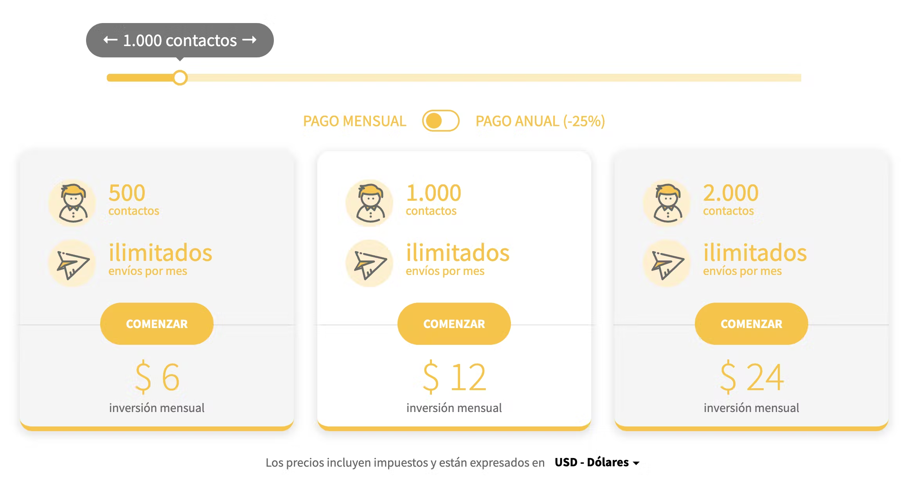

Desafío técnico backend

ES-AR 🇦🇷

Tech Challenge

El objetivo de este desafío consiste en implementar una nueva API para manejar el sistema de pricing de Perfit.

Actualmente esto esta funcionando en el monolito y la idea es rehacerlo pasandolo a un nuevo Microservicio.

Ahora se puede ver el funcionamiento a nivel UI en la siguiente imagen: 

Algunos puntos importantes:

* Debe realizarse utilizando cualquier version de SpringBoot y JAVA superior a version 8.
* La implementacion del repositorio de Pricing’s debe ser realizado en memoria.
* Es necesario realizar tests unitarios del repositorio, idealmente usar TDD para el live coding.

Necesitamos que implementes:

1. Creacion de 2 endpoints:
1. Un endpoint para listar el pricing, con sus respectivos filtros.
2. Un endpoint para crear un ContactsPricing.

* Existirán en el futuro 2 tipos de Pricing, EmailPricing (planes por cantidad de envios) y ContactsPricing (planes por cantidad de contactos)
    * Queremos que implementes: ContactsPricing, con esta estructura:
        * Un id identificador.
        * La cantidad de contactos disponibles
        * La cantidad de emails disponibles ( el valor es 0 si la cantidad de contactos es menor a 100.000, caso contrario cantidad de contactos x 12)
        * El precio, formateado en string decimal, con 2 decimales.
        * El currency Base siempre es USD.
* Al crear un Pricing, se debe respetar las siguientes reglas:
    * El id debe ser único.
    * No se puede crear si ya existe la cantidad de emails/contactos disponibles.
    * El valor de emails/contactos debe ser redondo (terminar en 0, o sea multiple de 10).

Code Quality

* Clean, readable, and maintainable code
* Proper use of Java and Spring Boot best practices

Functionality

* Correct implementation of the required features
* Basic error handling and validation

Documentation

* Brief README file with instructions on how to run the application

Submission Guidelines

* Create a public repository on GitHub.
* Upload your source code and any necessary configuration files to the repository.
* Include a README file with instructions on how to set up and run the application.
* Share the link to your GitHub repository via email by the given deadline.

https://coda.io/d/Desafio-Tecnico-Backend_dk8MpPF3fJa/Desafio-Tecnico-Backend_suxBh?searchClick=df9faa06-486c-46f4-9415-4524b4356914_k8MpPF3fJa#_luIHB